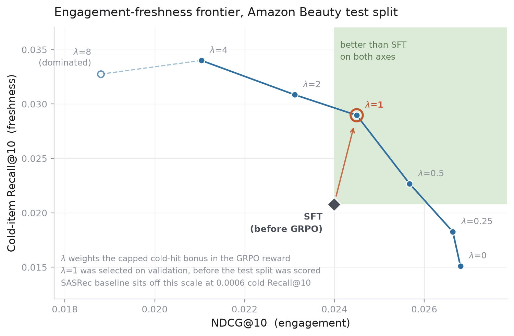

# rec-grpo

**A generative recommender, built end to end and post-trained with GRPO to recommend the new items it can already represent.**

---

## Overview

Recommendation systems learn what an item is from how users interact with it. Each item gets an embedding trained on its interaction history, and retrieval depends on that embedding. A newly added item has no interactions and no meaningful embedding, so the system cannot recommend it.

This project represents items with semantic IDs instead. An RQ-VAE encodes each item's title and description into a short sequence of discrete tokens, and a 13.1M-parameter transformer reads the user's history as one token sequence and generates the tokens of the next item. Recommendation becomes sequence generation over the catalog.

Because identity now comes from content, a new item is recommendable as soon as it is listed. On the Amazon Beauty benchmark, under a strict temporal split, the model reaches 0.0208 Recall@10 on items with zero training interactions. A tuned SASRec baseline scores 0.0006 on the same items: one hit, indistinguishable from picking at random (10/12,101 ≈ 0.0008), because an interaction-based embedding cannot describe an item that has not been interacted with.

Good representations do not fix the training data. The model learns from logged behavior, logged behavior is dominated by already-popular items, and the resulting policy seldom generates the new items it can represent. Temporal cold-start studies of semantic-ID models report the same effect.

The second stage of the project post-trains the model with GRPO. The reward is computed from held-out user behavior: slates are scored on ranking quality, with extra credit when a recommended cold item is one the user later engaged with. No reward model is trained. Cold-item recall rises 39%, from 0.0208 to 0.0290, and overall accuracy matches the supervised model (+0.9% Recall@10, +2.1% NDCG@10).

The gain is not memorization; the policy recommends never-rewarded cold items 61% more often after post-training. And because the reward's cold weight is tunable, sweeping it traces the full tradeoff between engagement and new-item exposure. 



## Results

Amazon Product Reviews (2014 benchmark), Beauty, 5-core: 22,363 users, 12,101 items, 198,502 interactions. Global temporal split (80/10/10 by timestamp), full-catalog ranking, no sampled negatives. Cold items (zero interactions in the training window) number 487, carrying 1,588 of the 19,850 test targets. λ=1 is the pre-registered operating point, selected on validation.

| Model | Recall@10 | NDCG@10 | Cold-item R@10 |
|---|---|---|---|
| SASRec (RecBole, tuned) | 0.0480 | 0.0260 | 0.0006 |
| Generative retriever (SFT) | 0.0450 | 0.0240 | 0.0208 |
| + GRPO, engagement-only (λ=0) | 0.0492 | 0.0268 | 0.0151 |
| + GRPO, cold-weighted (λ=1) | 0.0454 | 0.0245 | **0.0290** |
| + GRPO, cold-weighted (λ=4) | 0.0405 | 0.0210 | 0.0340 |

Engagement-only training improves NDCG while cold-item recall degrades (0.0208 → 0.0151): pure engagement optimization suppresses new items. Relative to that control, λ=1 trades 8.6% NDCG for a 92% cold-recall gain; relative to SFT it is accuracy-neutral (+0.9% Recall@10, +2.1% NDCG@10). Absolute numbers run below leave-one-out results in the literature because temporal splits remove evaluation leakage (Ji et al., ACM TOIS).

## Method

```
item text  →  frozen sentence encoder  →  RQ-VAE (3×256 codebooks)  →  semantic IDs
user history (token sequence)  →  13.1M decoder-only transformer  →  next-item IDs
                                   trie-constrained decoding over the catalog
SFT  →  GRPO with group-relative advantages, KL anchor to the SFT policy
reward = NDCG@10(slate, held-out interactions) + λ · capped cold-hit bonus
```

Cold items enter the trie when tokenized, so they can be generated without retraining. The cold-hit bonus is capped; uncapped variants fill slates with cold items and pay for it in warm accuracy. The GRPO reward and λ selection share the validation window; no model or hyperparameter choice used the test split, which was scored once per configuration after λ was fixed.

## Generalization check

Memorization is a claim about what the policy generates, so the test measures placements directly, across all 198,500 evaluation slate positions, with cold items split by whether the reward ever scored them:

| Model | Cold positions | Reward-visible | Never rewarded |
|---|---|---|---|
| SFT | 1.80% | 0.90% | 0.90% |
| λ=0 | 0.90% | 0.46% | 0.44% |
| λ=1 | 3.10% | 1.65% | 1.45% |
| λ=4 | 5.20% | 2.71% | 2.49% |

Memorization predicts the reward-visible column moves and the never-rewarded column stays flat. The never-rewarded column rises 61% at λ=1 (+0.55pp, 95% CI [+0.43, +0.67], user-clustered bootstrap, p < 0.001): the policy changed its behavior toward cold items as a class, including items it could not have memorized. Never-rewarded recall moves in the same direction (0.0214 → 0.0277), reported as lower-powered corroboration.

The gain is reach, not ranking: cold slots convert at 0.92% under SFT and 0.75% under λ=1. The reward increases exposure; improving cold-item ranking would be a different objective.

## Current and Future Work

The scope above is complete. Current work: a DPO variant on the same verifiable reward, a second domain (MIND, news recommendation) whose cold slice supports well-powered recall tests, and multi-seed runs to put confidence intervals on the frontier.

## Relation to prior work

MiniOneRec and OpenOneRec apply RL to generative recommendation on LLM backbones in the 0.5–3B range, following OneRec. This project runs the same class of pipeline at native recommender scale, the non-LLM configuration production ranking systems use, and measures the engagement-freshness tradeoff curve rather than a single operating point. All components are standard: TIGER-style semantic IDs, GRPO, trie-constrained decoding.

## Limitations

One dataset, one category, offline evaluation, a single seed.

SASRec is the standard sequential baseline and, by construction, a weak cold-start comparator; content-kNN is the informative comparison and is planned.

The 5-core filter counts test-window interactions, which makes the cold slice easier than production in both directions: items are admitted to the catalog on the strength of activity that has not happened yet, and every "cold" item is guaranteed at least five lifetime interactions where a genuine new arrival has one or none.

The cold-item recall figures rest on 1,588 targets and are correspondingly wide. That is why the generalization claim is measured on slate composition, across all 198,500 placements, rather than on recall alone.

## Citations

TIGER (Rajput et al., NeurIPS 2023) · HSTU (Zhai et al., ICML 2024) · OneRec (Kuaishou, 2025) · MiniOneRec (Kong et al., 2025) · GRPO (Shao et al., 2024) · Temporal cold start in semantic-ID generative retrieval (arXiv, 2026) · Data leakage in offline evaluation (Ji et al., ACM TOIS) · Amazon product data (McAuley et al., 2015)
