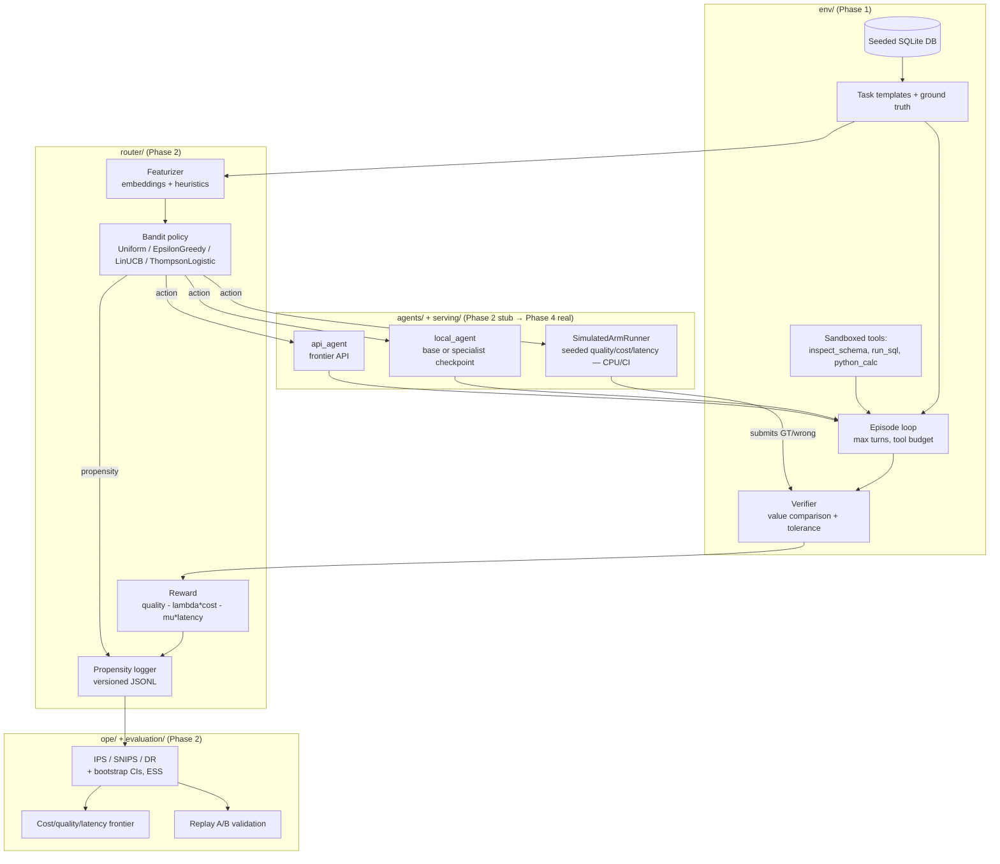

# Architecture

Data flow for the Specialist + Router system (from [`PROJECT_PLAN.md`](../PROJECT_PLAN.md)).
Components are implemented phase by phase. **Implemented so far:** the entire `env/` block
(Phase 1) and the `router/` + `ope/` blocks (Phase 2), driven on CPU by a **stub simulator**
backend in place of live agents. The real `local_agent`/`api_agent` arms exist behind the same
`ArmRunner`/`Agent` interfaces but are exercised only in Phase 4 (`serving.backend: real`); until
then the diagram's `agents/` box runs ahead of what CI drives.

Trust-critical, deterministic components — the verifier, task ground truth, and the OPE
estimators — are kept as small pure functions so they are trivially testable. Off-policy
evaluation applies **only** to the single routing decision, never to agent trajectories
(see [`PROJECT_PLAN.md`](../PROJECT_PLAN.md) §1.2).
