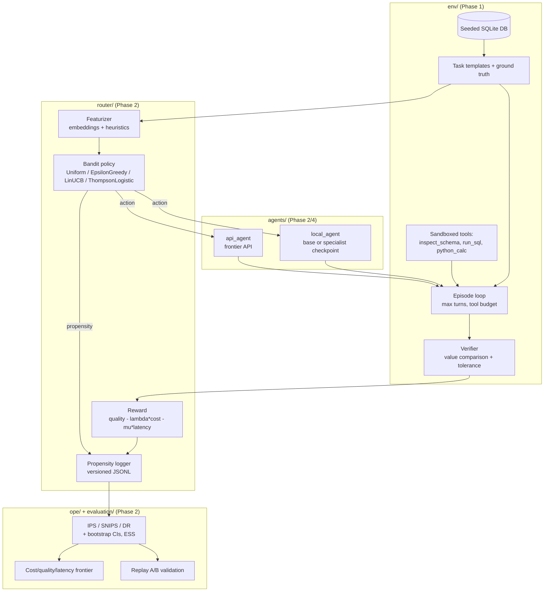

# Architecture

Data flow for the Specialist + Router system (from [`PROJECT_PLAN.md`](../PROJECT_PLAN.md)).
Components are implemented phase by phase. **Implemented so far:** the entire `env/` block
below (Phase 1) — seeded DB, task templates + ground truth, sandboxed tools, episode loop, and
verifier. The `agents/`, `router/`, and `ope/`/`evaluation/` blocks are Phase 2+ and this
diagram runs ahead of the code there until Phase 4.

Trust-critical, deterministic components — the verifier, task ground truth, and the OPE
estimators — are kept as small pure functions so they are trivially testable. Off-policy
evaluation applies **only** to the single routing decision, never to agent trajectories
(see [`PROJECT_PLAN.md`](../PROJECT_PLAN.md) §1.2).
